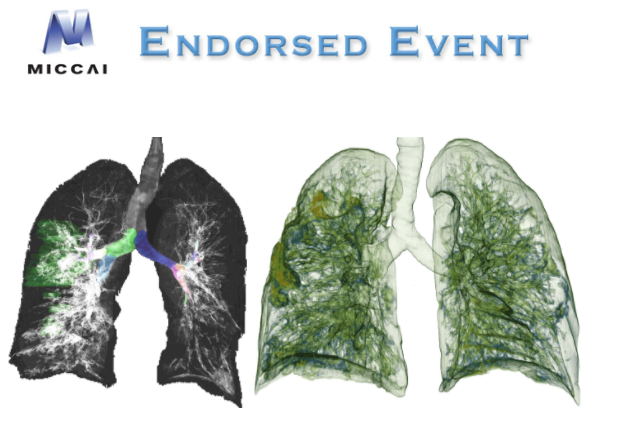

# COVID-19-20-Segmentation-Challenge
COVID-19 Lung CT Lesion Segmentation Challenge - 2020 
> This is an example of the CT imaging is used to segment Lung Lesion.

## Prerequisities
The following dependencies are needed:
- numpy >= 1.11.1
- SimpleITK >=1.0.1
- tensorflow-gpu ==1.14.0
- pandas >=0.20.1
- scikit-learn >= 0.17.1

## How to Use

**1、Preprocess**
* download data:https://covid-segmentation.grand-challenge.org/Download/
* generate patch(160,160,64) image and mask image.
* set window witdth and window level:-1000-0 HU.
* normalization image with mean is 0 and std is 1 method.

**2、Lung Lesion Segmentation**
* the Vnet3d model can find here:https://github.com/junqiangchen/VNetFamily
* more implementation detail can find Lung lobe project:https://github.com/junqiangchen/LungLobeSegmentation

## Result

* validation data result leadboard is 24.

* more detail can follow my WeChat Public article.

## Contact
* https://github.com/junqiangchen
* email: 1207173174@qq.com
* Contact: junqiangChen
* WeChat Number: 1207173174
* WeChat Public number: 最新医学影像技术
